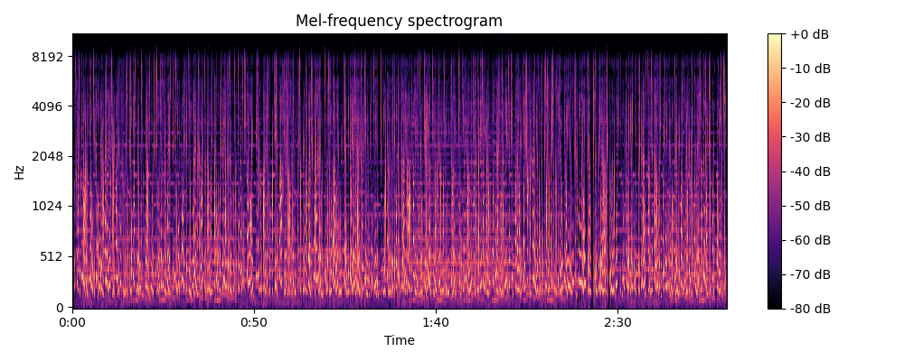
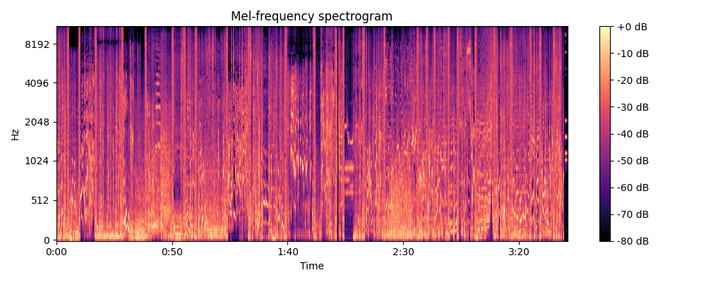

<!-- GETTING STARTED -->
## Getting Started

### Prerequisites
1. Install ffmpeg
   
2. Donwload Pretrain Models.
   
   2.1 Downlaod Vocal Separation model [UVR5](https://www.icloud.com.cn/iclouddrive/0bekRKDiJXboFhbfm3lM2fVbA#UVR5_Weights).

3. ASR model, VAD model, Punctuation model will be downloaded automatically.

### Installation
1. Create independent Python Environment.
   ```sh    
    conda create -n asr_toolkit python=3.9
    conda activate asr_toolkit
   ```
2. Clone the repo
   ```sh
   git clone git@github.com:Jeru2023/asr_toolkit.git
   ```
3. Install packages
   ```sh
   install -r requirements.txt
   ```
4. Place the downloaded UVR5 weights folder(uvr5_weights) under "models" directory.
   
## Usage
可以在executor.py的顶部修改input/output folder的常量，也可以在调用executor的方法时传入参数。<br>
默认情况下，视频文件的路径为'data', 最终文字的输出路径为'output/texts', 输出文件的文件名会与原始文件名保持一致，方便匹配。<br>

```python
   from executor import Executor

   executor = Executor()

   executor.convert_videos()
   # 如何不需要人声分离可以注释下一行代码
   executor.separate_vocals()
   executor.asr()
```

## Vocal Separation
人声伴奏分离批量处理， 使用UVR5模型。 <br> 目前代码中默认使用的是DeEcho-Aggressive模型。

模型分为三类： <br>
<li>1. 保留人声：不带和声的音频选这个，对主人声保留比HP5更好。内置HP2和HP3两个模型，HP3可能轻微漏伴奏但对主人声保留比HP2稍微好一丁点； </li>
<li>2. 仅保留主人声：带和声的音频选这个，对主人声可能有削弱。内置HP5一个模型； </li>
<li>3. 去混响、去延迟模型（by FoxJoy）：</li>
   <ul>
   <li>(1)MDX-Net(onnx_dereverb):对于双通道混响是最好的选择，不能去除单通道混响；</li>
   <li>(234)DeEcho:去除延迟效果。Aggressive比Normal去除得更彻底，DeReverb额外去除混响，可去除单声道混响，但是对高频重的板式混响去不干净。</li>
   </ul>
<br>

附：<br>
1. DeEcho-DeReverb模型的耗时是另外2个DeEcho模型的接近2倍；<br>
2. MDX-Net-Dereverb模型挺慢的；<br>
3. 个人推荐的最干净的配置是先MDX-Net再DeEcho-Aggressive。<br>

## Performance
系统会自动获取device信息决定是否启用GPU加速和半精度。<br>
代码在CPU上也可以运行，ASR可以调整decoder-thread-num，io-thread-num来最大化利用CPU算力。<br>
用Macbook Pro测试批处理两个视频，一个3分钟，一个2分15秒，总耗时29秒，其中28秒是ASR消耗。
用RTX4090运行同样的视频，处理时间14秒，提升一倍。

人声分离功能已集成，这也是个比较耗时的操作，正在尝试快速检测是否需要人声分离。

## Audio Filter
人声声谱特征: <br>
1. 基于基音频率检测:人声具有明显的基音频率特征,通常在80-300Hz区间。通过检测这个区间内能量峰值,可以判断是否存在人声。<br>
2. 基于共振峰检测:人声由于发声器官的共振作用,在一些特定频率会形成能量峰值,如小于1kHz的共振峰。检测这些共振峰可以判断人声存在。<br>
3. 基于频谱包络分析:人声频谱包络通常呈现出周期性的峰谷结构,可通过分析包络性质来检测人声。<br>
4. 基于频谱统计特征:计算诸如频谱平坦度、频谱熵、频谱扩展等统计量,人声和其它声源在这些特征上存在差异。<br>


背景音乐声谱特征: <br>
1. 和声频率分布: 背景音乐通常是多个乐器合奏,频谱上会有多个谐波成分和多个并行的共振峰,形成宽频带的和声频率分布。而人声的频谱分布相对较窄。<br>
2. 基音频率范围: 乐器的基音频率范围较宽,如钢琴基音从27.5Hz到4186Hz。而人声基音通常在80-300Hz的相对窄范围内。<br>
3. 共振峰位置: 人声的共振峰位置由发声器官决定,如声门峰在500Hz左右。而乐器共振峰则取决于乐器腔体等结构。<br>
4. 能量分布平稳性: 背景音乐各频带能量分布相对平稳,变化缓慢;而人声由于发声机理的脉冲特性,能量在时域和频域上都会有较大波动。<br>
5. 谱线特征: 人声谱线比较集中,而背景音乐由于多种乐器混合,谱线往往较为分散、杂乱。<br>
6. 振幅调制: 乐器音色的振幅调制速率较慢;而人声的振幅调制受发声方式的影响,变化较快。<br>
7. 谱线间隔: 乐器频谱中,不同谱线间的频率间隔服从一定规律,如钢琴八度频率比为2:1;而人声频谱间隔较为随机。<br>


<!-- ROADMAP -->
## Roadmap

- [*] 人声分离(H) - 修复bug
- [ ] Auto Detection(M) - 自动判断是否应该做人声分离
- [ ] multilingual(L) - 新增ARS英文模型
- [*] 声纹识别(L) - 多人对话时区分角色
- [] audio detector(H) - 过滤掉无效音频内容(标题判断，人声判断，头部抽样)
